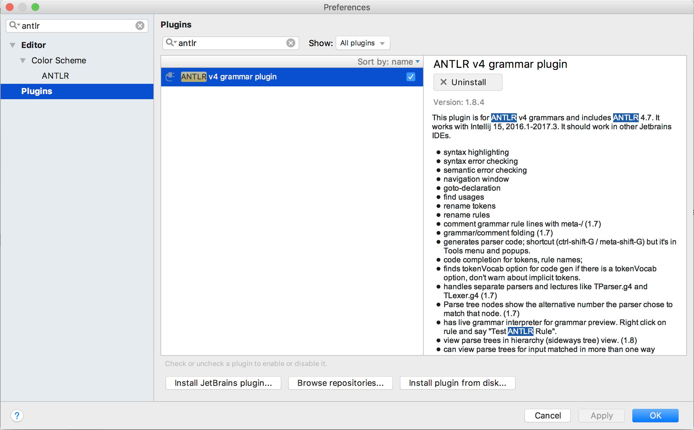
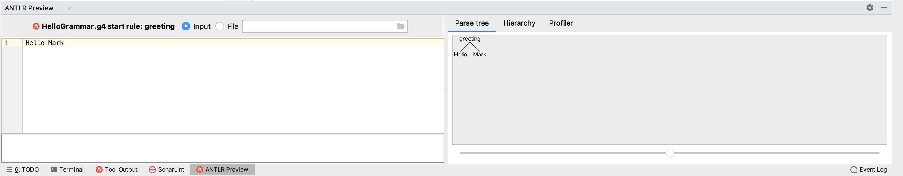

# ANTLR meetup

This hands-on consists of three different assignments that each have their own Maven module. 
All modules contain an ANTLR grammar that is partially defined. 
It is up to you to fix the accompanying tests by finishing the grammar definition. 
It's recommended to first define the missing parser and lexer rules so that the module can compile.
Afterwards you can improve your rules so that the tests pass.

## Assignment 1
This is a simple grammar consisting of one grammar rule and two lexer rules. 
A valid sentence in this grammar begins with "Hello", followed by a string that can contain lowercase and uppercase characters.  

Valid examples are:
* `Hello user`
* `Hello User`
* `Hello USER`

## Assignment 2
This grammar splits the lexer and the parser up in two different files, an approach that can improve readability for larger grammars. 
A valid sentence in this grammar can be one or more key-value pairs. 
The key should always be an uppercase alphanumeric string, while the value can be one or more lowercase alphanumeric strings separated by commas. 
Both keys and values cannot start with a number and are separated with a colon.  

Valid examples are:
* `(KEY:value)`
* `(KEY:value1,value2)`
* `(KEY1:value)(KEY2:value1,value2)`

Pay attention to the `ParserErrorListener` that is being added in this assignment and make sure you understand its purpose. 

## Assignment 3
This assignment demonstrates the visitor pattern. 
It uses the same grammar as assignment 2, so you can reuse the parser and lexer rules in this assignment's `KeyValuePairGrammar.g4` and `KeyValuePairLexer.g4`.
We have added a visitor class that needs to be implemented. This visitor converts our key-value pairs to Elasticsearch queries.

## Extra assignments
1: Expand the grammar defined in the previous assignment. Add boolean logic to combine our key-value pairs and reflect this in the resulting Elasticsearch queries.

Valid examples are:
* `(KEY1:value1) AND (KEY2:value2)`
* `(KEY1:value1) OR (KEY2:value2)`

2: Introduce nesting for your key-value pairs and reflect this in the resulting Elasticsearch queries.

Valid examples are:
* `(KEY1:value1) AND ((KEY2:value1) OR (KEY2:value2))`

3: Expand the definition of a term to include diacritics such as à and ë in a generic way. Don't forget to write additional testing for these new cases.

Valid examples are:
* `(KEY:väƛȗé)`

## Tips
Compiling the Maven module after every grammar change can be tedious. 
IntelliJ has an ANTLR plugin that allows you to test your grammar without compiling it first.  

* **Install the plugin and restart IntelliJ:**

* **Configure the plugin to generate your grammar upon saving (⌘ + S):**
right click on the root rule of your grammar (e.g. "greeting") and select the option "Configure ANTLR". 
Check the checkbox "Auto-generate parsers upon save" and close the dialog. 
* **Test your grammar**: right click on the root rule of your grammar and select the option "Test rule". 
The ANTLR Preview toobar will appear. Enter your query and observe the parse tree that is being generated:

## Further reading

* [ANTLR development tools](http://www.antlr.org/tools.html)
* [ANTLR4 documentation (Github)](https://github.com/antlr/antlr4/blob/master/doc/index.md)
* [The Definitive ANTLR 4 Reference (book)](https://pragprog.com/book/tpantlr2/the-definitive-antlr-4-reference)